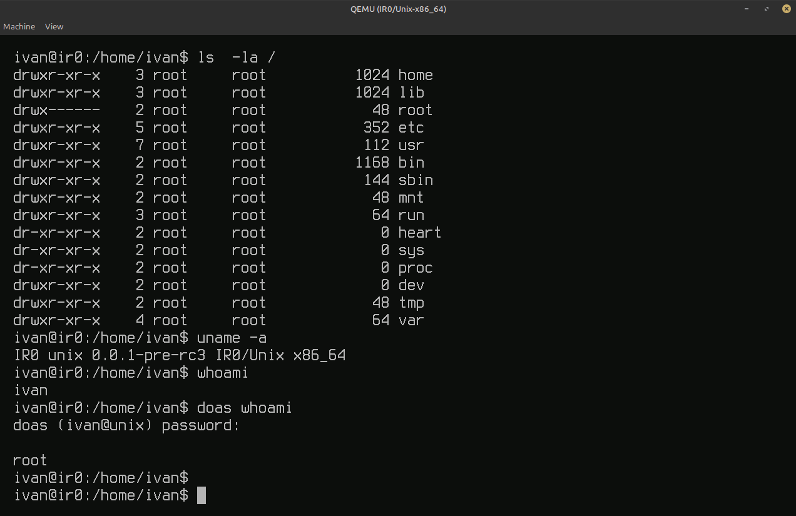

# IR0-userspace

Declarative builder for **ISD — IR0 Software Distribution**, the canonical
minimal product image on top of the IR0 kernel: runit PID 1, BusyBox,
login/auth, firstboot, recovery, and `/etc` overlays.

Sibling kernel: [`IR0`](https://github.com/IRodriguez13/IR0) — public UAPI
(`headers_install`), pack adapters, and integration smokes. See
[`Documentation/DISTRO_CONTRACT.md`](Documentation/DISTRO_CONTRACT.md).

| Layer | Repo | Role |
|-------|------|------|
| Kernel | [IR0](https://github.com/IRodriguez13/IR0) | mechanisms, drivers, UAPI, KTM |
| Userland | **IR0-userspace** (this tree) | packages, init, services, rootfs |
| Product | **ISD** | integrated bootable image |

<p align="center">
  
</p>

<p align="center"><em>ISD first boot wizard (generic account; password also authenticates doas).</em></p>

<p align="center">
  
</p>

<p align="center"><em>Minimal shell session after login: rootfs layout, <code>uname -a</code>, <code>doas</code>.</em></p>

```bash
# Sibling layout (recommended)
git clone https://github.com/IRodriguez13/IR0.git
git clone https://github.com/IRodriguez13/IR0-userspace.git
cd IR0
make defconfig
make first-boot          # wires UAPI + rootfs + ISO via this repo
make run
```

From this tree alone:

```bash
export IR0_ROOT=../IR0
make fetch
make headers             # or: IR0_UAPI_TARBALL=/path/ir0-uapi.tar
make build ARCH=x86_64
make rootfs-tree PROFILE=minimal ARCH=x86_64
make image-minix PROFILE=minimal ARCH=x86_64
```

Compat symlinks under `out/{busybox-full,bin,stage-bin,smoke}` keep the kernel
Makefile paths working after `out/<arch>/product/` relocation.


## Profiles

| Profile | Role |
|---------|------|
| `minimal` | **Default** — first-boot user registration + doas |
| `development` | Lab only (root autologin / fixtures) |
| `desktop` | minimal + nano/ncurses for IR0-desktop |
| `appliance` | Services only |

## Layout

```text
packages/        upstream recipes + setuid.allowlist
profiles/        profile.conf, packages, applets, services, overlay
rootfs/base/     canonical /etc (no personal accounts)
scripts/         toolchain, stage-rootfs, pack-minix, audits
services/        runit stages, console, firstboot, …
out/<arch>/      product/ tests/ smoke/ rootfs/<profile>/
Documentation/   distro contract and guides
```

## Gates

```bash
make toolchain-check ARCH=x86_64
make profiles-check
make personal-data-check
make rootfs-check PROFILE=minimal
make release-check PROFILE=minimal ARCH=x86_64
```
