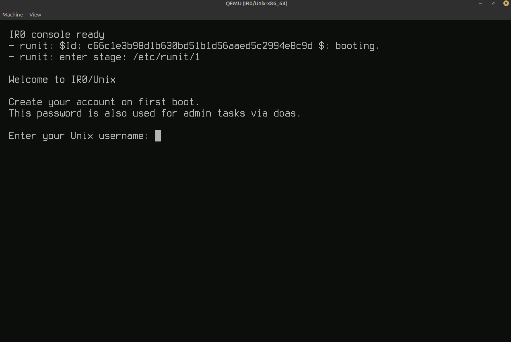
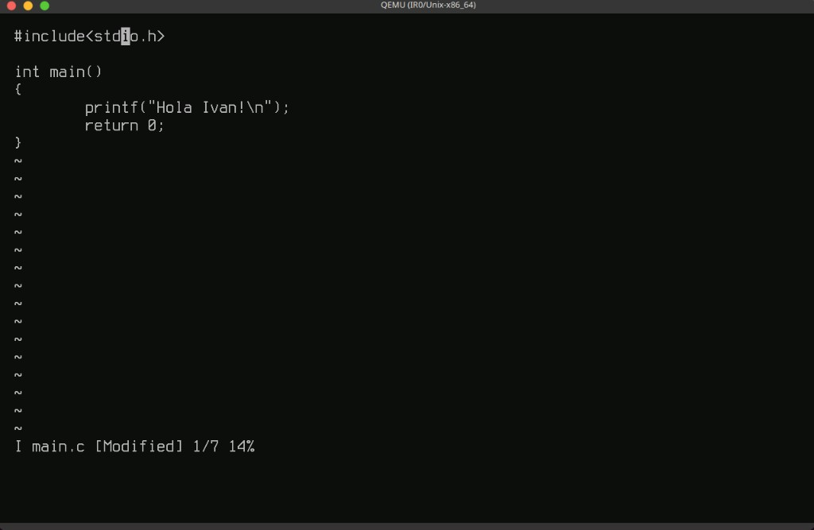

# ISD — IR0 Software Distribution

Declarative, stamp-based builder for the canonical product image on top of the
IR0 kernel: runit PID 1, BusyBox, login/auth, firstboot, recovery, and `/etc`
overlays.

Sibling kernel: [`IR0`](https://github.com/IRodriguez13/IR0) — public UAPI
(`headers_install`), pack adapters, and QEMU/`first-boot` orchestration. See
[`Documentation/DISTRO_CONTRACT.md`](Documentation/DISTRO_CONTRACT.md) and
[`Documentation/PACKAGES.md`](Documentation/PACKAGES.md).

| Layer | Repo | Role |
|-------|------|------|
| Kernel | [IR0](https://github.com/IRodriguez13/IR0) | mechanisms, drivers, UAPI, boot ISO |
| Distro | **ISD** (this tree) | packages, init, services, rootfs, `disk.img` |

<p align="center">
  
</p>

<p align="center"><em>ISD first boot wizard (generic account; password also authenticates doas).</em></p>

<p align="center">
  
</p>

<p align="center"><em>After login: BusyBox <code>vi</code> on the MINIX rootfs — edit guest sources under QEMU (<code>make run PROFILE=minimal</code> from IR0).</em></p>

## Fastest path (from IR0)

```bash
git clone https://github.com/IRodriguez13/IR0.git
cd IR0
make first-boot PROFILE=minimal    # clones ../ISD, asks before sudo install
make run PROFILE=minimal
```

Layout:

```text
parent/
├── IR0/          # kernel + first-boot / run-isd
└── ISD/          # this repo — owns out/<arch>/images/<profile>/disk.img
```

`make first-boot` does **not** inject BusyBox/runit one-by-one. It builds the
ISD image for `PROFILE` and boots that disk. Legacy inject remains behind
`IR0_LEGACY_USERSPACE=1` for smokes.

## From this tree alone

```bash
export IR0_ROOT=../IR0
make isd-defconfig                 # writes .isdconfig if missing
make fetch
make headers                       # or: IR0_UAPI_TARBALL=/path/ir0-uapi.tar
make build ARCH=x86_64 PROFILE=minimal
make rootfs-tree PROFILE=minimal
make image-minix PROFILE=minimal   # → out/x86_64/images/minimal/disk.img
```

Extras (optional packages beyond `profiles/<p>/packages.txt`):

```bash
make isdconfig PROFILE=minimal
# or: python3 scripts/isdconfig.py set CONFIG_PKG_NANO=y
```

## Profiles

| Profile | Role |
|---------|------|
| `minimal` | **Default** — first-boot user registration + doas + nano |
| `development` | Lab only (root autologin / fixtures) |
| `desktop` | desktop policy + nano/ncurses |
| `appliance` | Services only (busybox + runit) |

Per-profile outputs:

```text
out/<arch>/rootfs/<profile>/
out/<arch>/images/<profile>/disk.img
out/<arch>/stamps/{toolchain,uapi,packages,services,rootfs,images}/
```

Package stamps depend on the **toolchain only** (not UAPI). Services need UAPI.
See [`Documentation/PACKAGES.md`](Documentation/PACKAGES.md).

## Layout

```text
packages/        upstream recipes + setuid.allowlist
profiles/        profile.conf (policy), packages.txt (truth), overlay/
rootfs/base/     canonical /etc (no personal accounts)
scripts/         resolve-packages, isdconfig, stamp-run, stage-rootfs, …
services/        runit stages, console, firstboot, …
out/<arch>/      product/ stamps/ rootfs/<profile>/ images/<profile>/
Documentation/   distro contract and guides
```

## Gates

```bash
./tests/contracts/run.sh
make toolchain-check ARCH=x86_64
make profiles-check
make personal-data-check
make rootfs-check PROFILE=minimal
make release-check PROFILE=minimal ARCH=x86_64
```
